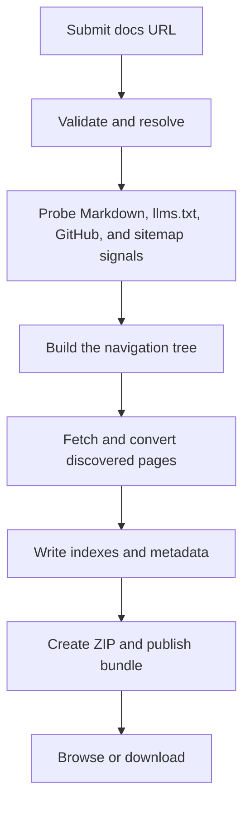

# Agent Cache

<p align="center">
  
</p>

> Give a coding agent a local copy of the documentation it needs.

Paste a documentation URL into [agentcache.run](https://agentcache.run). Agent Cache discovers the site's pages, converts them to Markdown, organizes the result, and gives you a browser view and a ZIP download.

The goal is to keep the useful details intact: API references, examples, and the pages around them. A generated bundle is a set of files you can keep in your project and use offline.

## What you can do

### Turn a docs URL into a bundle

Submit a docs URL, including a deep link into a documentation section. The form adds `https://` when the scheme is missing and checks that the URL is reachable and does not lead to a parked domain. The resolver inspects the site for documentation metadata and a canonical docs location.

### Discover pages and preserve their structure

Agent Cache looks for `llms.txt`, `llms-full.txt`, Markdown endpoints, sitemaps, navigation data, and links in the docs site. It can read navigation exposed by supported documentation platforms, then falls back to parsing the site's HTML navigation and links.

The resulting tree keeps nested sections and tabs where the site exposes them. The page count shown during and after a job is the number of documentation pages discovered in that tree. Progress shows how many pages the crawler has processed.

### Convert pages to Markdown

When a site provides Markdown, Agent Cache can use it directly. Otherwise, it requests HTML, removes common page chrome such as navigation and footers, and converts the main content to Markdown. Code blocks and links are retained where the source makes them available. Each generated page includes its title, source URL, and section in front matter.

Extraction is best effort. A page that cannot be fetched or converted gets a note in its Markdown file, and the crawler continues with the other pages. The discovered page count is therefore not a guarantee that every page contains successfully extracted content. A site that blocks requests or hides its navigation from plain HTTP can still produce an incomplete bundle or fail before crawling starts.

### Browse, download, and find previous bundles

Each completed job has a docs page with product details, page count, extraction strategy, and a searchable, collapsible navigation tree. The tree links back to the original documentation pages. Download the ZIP from that page, or open the public [docs library](https://agentcache.run/docs) to find completed bundles. The library groups repeat exports by domain and shows the newest version first.

The ZIP contains the extracted Markdown and generated indexes and metadata:

```text
INDEX.md       # Main table of contents
_map.json      # Discovered page hierarchy
meta.yaml      # Source URL and agent-oriented metadata
llms-full.txt  # Included when the source provides one
01-section/
  INDEX.md
  01-page.md
  02-page.md
```

The exact folders depend on the source site's navigation. Section and page names are numbered to keep their order stable.

### Watch extraction and inspect failures

The job page streams phase, log, and page progress events while extraction runs. It also provides a raw text log. Events are saved to object storage so a job's recorded output can be replayed after the original request has ended.

If a job fails, the UI shows a readable explanation and keeps technical error details available for inspection. The job record also stores its status, source and resolved URLs, selected strategy, discovered page count, ZIP size, and timestamps.

### Report problems with a bundle

The docs viewer includes a feedback form tied to the bundle. A reader can report missing pages, wrong content, outdated docs, broken links, or another issue. Reports include an email address and details so the project owner can follow up. Submissions are stored with the job ID and appear in the admin dashboard.

### Review usage and job health

The password-gated admin page summarizes jobs, page totals, ZIP sizes, failures, and feedback. It also shows recent traffic, including the human, coding-agent, and bot categories detected by request headers, plus popular paths, actions, referrers, and visitor locations when the hosting proxy provides them.

### Use the service API

The web app exposes JSON endpoints for creating and listing jobs, reading job status, and retrieving a job's navigation tree. The probe endpoint resolves a URL and reports which acquisition strategy and documentation signals it found.

```bash
curl -X POST https://agentcache.run/api/jobs \
  -H 'Content-Type: application/json' \
  -d '{"url":"https://hono.dev/docs/"}'
```

The response includes links for job status, the tree, logs, the live event stream, the browser viewer, and the ZIP download. See the [OpenAPI specification](https://agentcache.run/openapi.json) for request and response details.

The site also publishes [`llms.txt`](https://agentcache.run/llms.txt), [`llms-full.txt`](https://agentcache.run/llms-full.txt), and machine-readable agent discovery documents under `/.well-known/`.

## How an extraction runs



The acquisition choice is recorded with the job. The engine can use a site's `llms.txt`, raw Markdown endpoints, or HTML conversion. When it finds a GitHub edit link to a Markdown source, it tries that raw file. A vendor `llms-full.txt`, when available, is included as a companion file. Finding a repository link does not mean every page will be fetched from GitHub.

## Start locally

From this repository's root:

```bash
bun install
cp .env.example .env
```

Set the Cloudflare R2 account ID, access key, secret key, and bucket in `.env`. Jobs upload their logs, Markdown files, and ZIP archives to R2. Set `R2_PUBLIC_URL` if you want download links to use a public bucket URL.

Set `TAVILY_API_KEY` for the docs resolver. `OPENROUTER_API_KEY` is optional. Without an OpenRouter key, the bundle metadata generator uses its local fallback based on the product name, page titles, and navigation sections.

The default database is a local SQLite file at `storage/agent-cache.db`. For a remote Turso database, set `TURSO_DATABASE_URL` and `TURSO_AUTH_TOKEN`.

Start the development server:

```bash
bun run dev
```

Open [http://localhost:10901](http://localhost:10901). The production command is `bun run start`.

## API routes

| Route | Method | Purpose |
|---|---|---|
| `/api/jobs` | `POST` | Validate a URL, create a job, and start extraction |
| `/api/jobs` | `GET` | List recent completed jobs |
| `/api/jobs/:id` | `GET` | Read job status and artifact links |
| `/api/jobs/:id/tree` | `GET` | Read the discovered navigation tree |
| `/api/probe` | `POST` | Resolve a docs URL and inspect acquisition options |
| `/api/feedback` | `POST` | Submit feedback for a bundle |
| `/dingdong/:id/stream` | `GET` | Stream job events using Server-Sent Events |
| `/dingdong/:id/raw-log` | `GET` | Read the job log as plain text |
| `/docs/:id` | `GET` | Browse a completed bundle |
| `/docs/:id/download` | `GET` | Download its ZIP archive |
| `/health` | `GET` | Check server health |
| `/openapi.json` | `GET` | Read the OpenAPI 3.0 document |

## Site pages and content

The live sitemap lists 58 public URLs: 10 service and index pages, 40 blog articles, and 8 comparison articles. The list below describes the app's pages and route families. Job pages are generated for each extraction, so their number changes over time.

### Main pages

| Page | What it contains |
|---|---|
| [Home](https://agentcache.run/) | Docs URL form and extraction walkthrough |
| [Docs library](https://agentcache.run/docs) | Paginated list of completed bundles, grouped by source domain |
| `/docs/{job-id}` | One bundle's metadata, page count, strategy, navigation tree, feedback form, and download link |
| `/dingdong/{job-id}` | Live extraction status, event stream, and raw log link |
| [About](https://agentcache.run/about) | Project purpose and extraction approach |
| [Contact](https://agentcache.run/contact) | Contact and issue-reporting options |
| [Privacy](https://agentcache.run/privacy) | Data collected and retention details |
| `/cockpit` | Internal job, usage analytics, and feedback dashboard |

### Blog and comparisons

The repository contains 40 articles in [`content/blog/`](content/blog/) and 8 comparison pages in [`content/compare/`](content/compare/). Each has an individual page. The indexes and feeds are:

- [Blog index](https://agentcache.run/blog) and [blog RSS feed](https://agentcache.run/blog/feed.xml)
- [Comparison index](https://agentcache.run/compare) and [comparison RSS feed](https://agentcache.run/compare/feed.xml)
- [Combined RSS feed](https://agentcache.run/feed.xml)
- [All published page links](https://agentcache.run/llms.txt) and [XML sitemap](https://agentcache.run/sitemap.xml)

### Machine-readable pages

- [`/openapi.json`](https://agentcache.run/openapi.json): OpenAPI 3.0 API specification
- [`/llms.txt`](https://agentcache.run/llms.txt): Service description, API links, articles, comparisons, and feeds
- [`/llms-full.txt`](https://agentcache.run/llms-full.txt): Full text of the site's published content
- [`/health`](https://agentcache.run/health): Service health response
- `/.well-known/agent-card.json` and `/.well-known/api-catalog`: agent and API discovery
- `/.well-known/oauth-authorization-server`, `/.well-known/oauth-protected-resource`, and `/.well-known/openid-configuration`: OAuth and OpenID discovery documents

### How documentation page counts work

A docs bundle's page count is specific to that extraction, not a fixed count for the app. The viewer and library show the count recorded for each job. It counts pages discovered in the navigation tree; live progress counts pages processed. If an individual page fails, the crawler records a note in that page's Markdown file and continues, so the discovered count does not guarantee that every page has full extracted content. The demo counts on the homepage are examples, not a live inventory of stored pages.

## Repository map

```text
src/app/                  Web pages, API endpoints, and streamed job views
src/features/engine/      URL resolver, acquisition probes, topology, crawler, and packager
src/features/jobs/        Job lifecycle and database operations
src/lib/clients/          Turso and Cloudflare R2 clients
src/lib/url-rules/        URL validation rules
src/components/           Shared page and docs-tree components
content/blog/             Blog articles
content/compare/          Product comparisons
deploy/                   Docker and Caddy deployment files
library/                  Architecture and brand references
tests/                    Focused unit tests
```

For deployment instructions, see [`deploy/DEPLOY.md`](deploy/DEPLOY.md). Architecture references are in [`library/system-design.md`](library/system-design.md) and [`library/architecture.v0.2.md`](library/architecture.v0.2.md). Those documents include design decisions that may differ from the current code, so treat the implementation as the source of truth when they conflict.

## Development commands

```bash
bun run dev
bun run lint
bun run typecheck
bun run check
```

`bun run check` applies Biome fixes, then runs TypeScript and lint checks. The focused tests are `tests/markdown-twins.test.ts` and `tests/agent-errors.test.ts`.

## License

This repository does not currently include a license file. Check with the project owner before redistributing it.
